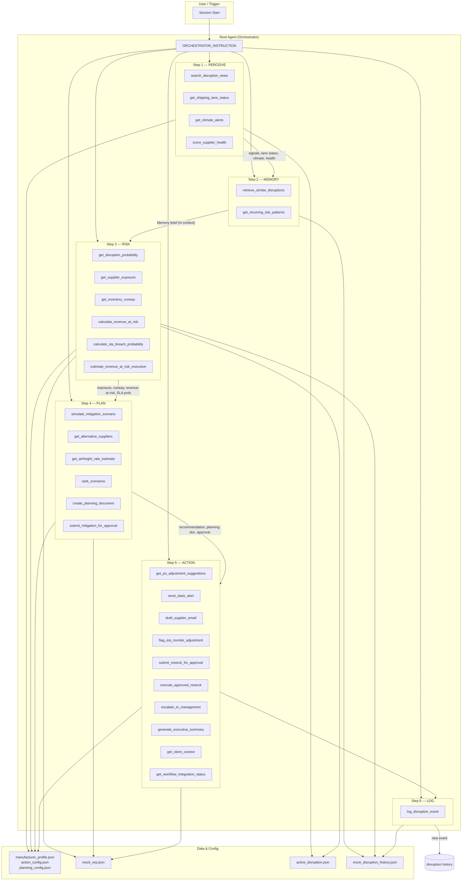

# Supply Chain Resilience Agent — Architecture & Information Flow

This document describes how the **instruction** and **information** flow through the agent system, and how components are connected.

---

## High-Level Architecture

The system supports **two runtime modes**:

1. **Sub-agent mode (default)** — The root orchestrator has **sub-agents as tools** (via `DelayedAgentTool`). It calls `rate_limit_breather` then **perception_agent**, **memory_learning_agent**, **risk_intelligence_agent**, **scenario_planning_agent**, **action_execution_agent** in order. Each sub-agent has its own instruction and tools; when the orchestrator invokes a sub-agent, that agent runs (with its tools) and returns a summary. All sub-agent tools are wrapped with **`with_reasoning_log`** so every tool call and result streams to the UI in real time.

2. **Flat mode** — Single root agent with **all tools** registered directly (`orchestrator_agent/agent_flat.py`). No sub-agent delegation; the pipeline is enforced in the instruction. Use with `ORCHESTRATOR_USE_FLAT=1` if sub-agent mode hits "Tool use with function calling is unsupported" or for fewer API round-trips.

```
┌─────────────────────────────────────────────────────────────────────────────────┐
│                    ROOT AGENT: supply_chain_orchestrator                         │
│  • Model: Gemini (GEMINI_MODEL)                                                  │
│  • Instruction: full pipeline (Steps 1–6)                                             │
│  • Tools (sub-agent mode): rate_limit_breather + DelayedAgentTool(perception_agent)  │
│    + memory_agent + risk_agent + planning_agent + action_agent                    │
└─────────────────────────────────────────────────────────────────────────────────┘
         │                │                │                │                │
         ▼                ▼                ▼                ▼                ▼
   perception_agent  memory_agent   risk_agent    planning_agent   action_agent
   (each has tools wrapped with with_reasoning_log → OBSERVE/MEMORY/REASONING/PLANNING/ACTION + RESULT)
         │                │                │                │                │
         └────────────────┴────────────────┴────────────────┴────────────────┘
                                          │
                                          ▼
┌─────────────────────────────────────────────────────────────────────────────────┐
│  reasoning_log: OBSERVE / MEMORY / REASONING / PLANNING / ACTION / RESULT        │
│  → ui/data/agent_reasoning_stream.json → GET /api/agent-stream → UI (realtime)    │
└─────────────────────────────────────────────────────────────────────────────────┘
```
---

## Instruction & Information Flow (Detailed)

### 1. Instruction flow

- **Sub-agent mode:** The orchestrator's instruction is built by `_build_instruction(enabled)` in `orchestrator_agent/agent.py`. By default all five sub-agents are enabled and `_full_pipeline_instruction(profile)` is used (same level of detail as flat).
- **Flat mode:** Single source of pipeline logic in `orchestrator_agent/agent_flat.py`; the LLM receives one instruction and is told to execute **Steps 1–6** in order.
- **Steps 1–6:** PERCEIVE → MEMORY → RISK (if HIGH/CRITICAL) → PLAN → ACTION → LOG (`log_disruption_event`). In sub-agent mode the orchestrator calls each sub-agent as a tool; in flat mode it calls the same tools directly.
- **Sub-agent instructions** (`perception_agent/agent.py`, `memory_agent/agent.py`, etc.) are used when that agent is invoked as a tool; they define each agent's behavior and tool use.

### 2. Information flow (data in → tools → data out)

| Stage   | Inputs (from previous steps or config) | Tools called | Outputs (passed forward or stored) |
|---------|----------------------------------------|--------------|------------------------------------|
| **Perceive** | Fixed query "global supply chain disruptions"; lane names; regions; supplier IDs from instruction | `search_disruption_news`, `get_shipping_lane_status`, `get_climate_alerts`, `score_supplier_health` | News signals, lane status (OPERATIONAL/DISRUPTED), climate alerts per region, supplier health scores → used as **inputs** to risk and optionally to `get_disruption_probability(…, news_signals_json, climate_alerts_json, shipping_lane_status_json, supplier_health_json)`. |
| **Memory**   | Disruption type & region (derived from Step 1) | `retrieve_similar_disruptions`, `get_recurring_risk_patterns` | Similar past cases, recurring patterns → **context** for risk/planning (in prompt); not passed as structured JSON to other tools except implicitly via model context. |
| **Risk**     | Step 1 results; optional: news/climate/lane/health JSON strings | `get_disruption_probability`, `get_supplier_exposure`, `get_inventory_runway`, `calculate_revenue_at_risk`, `calculate_sla_breach_probability`, `estimate_revenue_at_risk_executive`; optionally `get_operational_impact` | Disruption probability %, exposure, runway days, revenue at risk, SLA breach probability, executive summary → **inputs** to planning (delay_days, severity) and action (exposure, escalation triggers). |
| **Planning** | Risk outputs (delay_days, item_id, exposure); manufacturer profile (risk appetite) | `simulate_mitigation_scenario`, `get_alternative_suppliers`, `get_airfreight_rate_estimate`, `rank_scenarios`, `create_planning_document`, optionally `submit_mitigation_for_approval` | Scenario comparison, top recommendation, planning document (persisted to `ui/data/planning_documents.json`) → **inputs** to action (what to recommend, cost, scenario name). |
| **Action**   | Planning recommendation; risk (exposure, severity); thresholds from instruction/config | `get_po_adjustment_suggestions`, `submit_restock_for_approval`, `execute_approved_restock`, `send_slack_alert`, `draft_supplier_email`, `flag_erp_reorder_adjustment`, `escalate_to_management`, `generate_executive_summary`, `get_client_context`, `get_workflow_integration_status`, `submit_mitigation_for_approval` | Alerts sent, drafts created, approvals written to `ui/data/pending_approvals.json`, escalations to `ui/data/escalations.json`, ERP flags → **human-facing** and **audit**. |
| **Log**      | Event type, region, severity, suppliers, description, action, cost | `log_disruption_event` | New event appended to disruption history (and optionally Qdrant) → **input** to future **Memory** (retrieve_similar_disruptions, get_recurring_risk_patterns). |

### 3. Connection diagram (Mermaid)



### 4. Tool → UI / persistence

| Output | Where it goes |
|--------|----------------|
| **Reasoning stream** | Every tool call (and result) is logged via `with_reasoning_log` → `append_entry` → `ui/data/agent_reasoning_stream.json` → API `GET /api/agent-stream` → UI. |
| **Planning documents** | `create_planning_document` → append to `ui/data/planning_documents.json` → visible in Past crisis / Planning documents. |
| **Approvals** | `submit_mitigation_for_approval`, `submit_restock_for_approval` → append to `ui/data/pending_approvals.json` → Approval Inbox. |
| **Escalations** | `escalate_to_management` → append to `ui/data/escalations.json` → management view. |
| **Disruption history** | `log_disruption_event` → append to `data/mock_disruption_history.json` (and optionally Qdrant) → used by Memory in future runs. |

---

## Summary

- **Two modes:** Sub-agent (default): orchestrator has sub-agents as tools; flat (`ORCHESTRATOR_USE_FLAT=1`): single agent with all tools. Pipeline is Perception → Memory → Risk → Planning → Action → Log.
- **Information flows** from perception tools → (optional) risk tools’ optional JSON args → risk outputs → planning inputs → action inputs; memory and log read/write disruption history.
- **Config and data** (manufacturer profile, ERP, active disruption, planning config, action config, disruption history) are read by the tools; **UI state** (stream, planning docs, approvals, escalations) is written by the same tools and served by the Next.js API.

For a detailed description of **each agent**, **each tool**, and **calculations**, see [AGENTS_AND_TOOLS_REFERENCE.md](./AGENTS_AND_TOOLS_REFERENCE.md).
